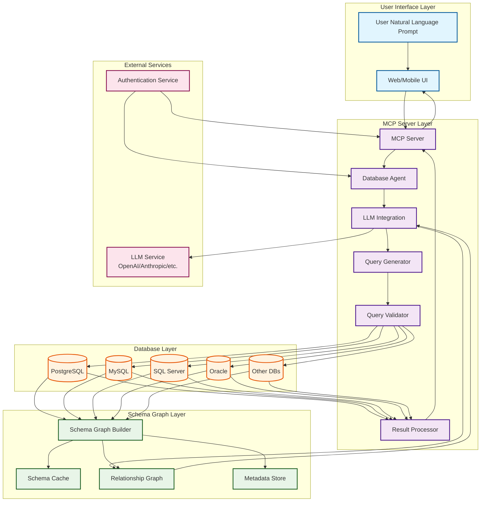
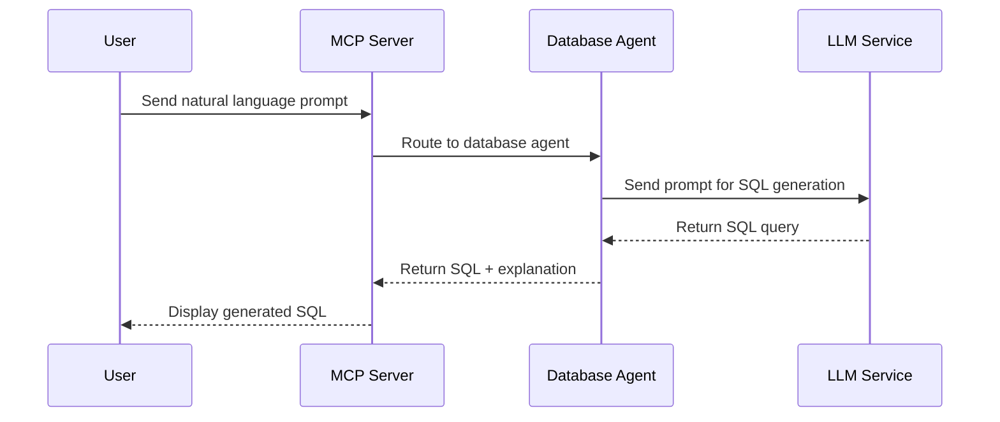
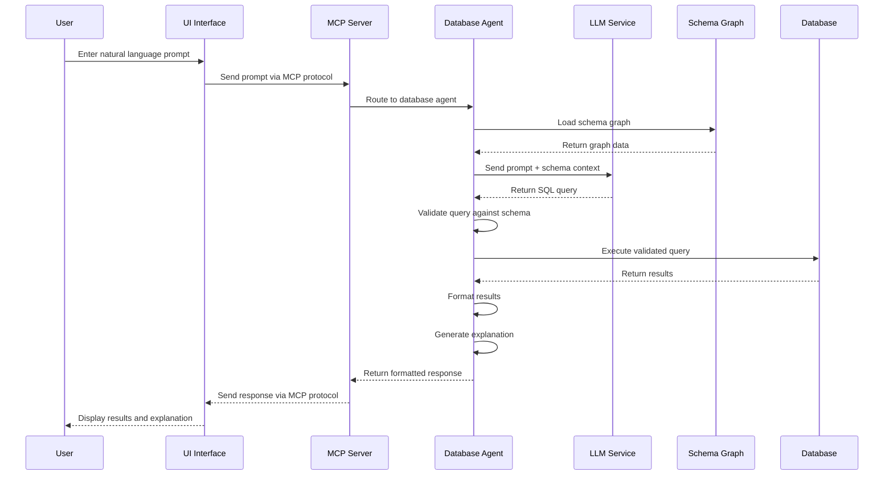
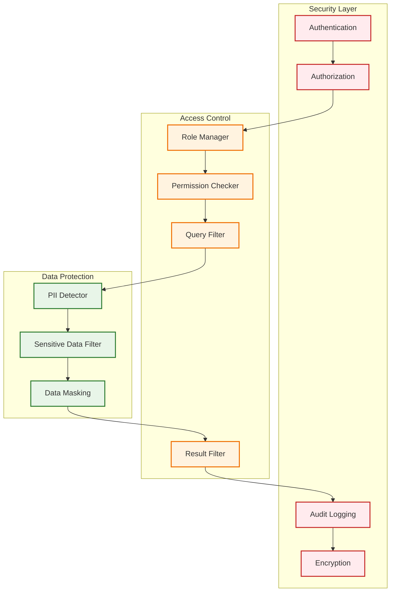
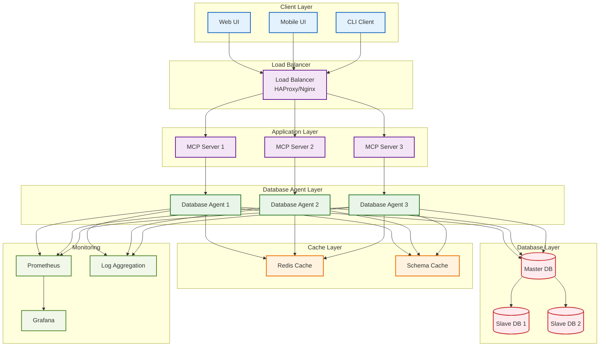

# Database Agent Architecture Diagram

## System Overview (Phase 1 - Current State)

**Note**: This diagram shows the planned full architecture. Currently, only the SQL generation components are implemented in Phase 1.

## Detailed Component Architecture

### Phase 1 Implementation Status
- **✅ Implemented**: MCP Server, LLM Integration, Basic Query Tool
- **🔄 Planned**: Schema Graph Engine, Query Execution, Result Processing
- **📋 Future**: Memory System, Planning Engine, Autonomous Decision Making

```mermaid
graph LR
    subgraph "Database Agent Core"
        subgraph "Input Processing"
            PROMPT_PARSER[Prompt Parser]
            CONTEXT_BUILDER[Context Builder]
        end

        subgraph "Query Generation"
            LLM_WRAPPER[LLM Wrapper]
            GRAPH_NAVIGATOR[Graph Navigator]
            SQL_BUILDER[SQL Builder]
        end

        subgraph "Query Execution"
            QUERY_EXECUTOR[Query Executor]
            CONNECTION_POOL[Connection Pool]
            TRANSACTION_MGR[Transaction Manager]
        end

        subgraph "Result Handling"
            RESULT_FORMATTER[Result Formatter]
            ERROR_HANDLER[Error Handler]
            EXPLANATION_GENERATOR[Explanation Generator]
        end
    end

    subgraph "Schema Graph Engine"
        subgraph "Graph Management"
            GRAPH_LOADER[Graph Loader]
            GRAPH_UPDATER[Graph Updater]
            GRAPH_QUERY[Graph Query Engine]
        end

        subgraph "Relationship Analysis"
            FK_DETECTOR[FK Detector]
            RELATIONSHIP_SCORER[Relationship Scorer]
            PATH_FINDER[Path Finder]
        end
    end

    subgraph "MCP Integration"
        MCP_HANDLER[MCP Handler]
        TOOL_REGISTRY[Tool Registry]
        RESPONSE_BUILDER[Response Builder]
    end

    %% Data Flow
    PROMPT_PARSER --> CONTEXT_BUILDER
    CONTEXT_BUILDER --> GRAPH_NAVIGATOR
    GRAPH_NAVIGATOR --> LLM_WRAPPER
    LLM_WRAPPER --> SQL_BUILDER
    SQL_BUILDER --> QUERY_EXECUTOR
    QUERY_EXECUTOR --> CONNECTION_POOL
    CONNECTION_POOL --> TRANSACTION_MGR
    TRANSACTION_MGR --> RESULT_FORMATTER
    RESULT_FORMATTER --> ERROR_HANDLER
    ERROR_HANDLER --> EXPLANATION_GENERATOR
    EXPLANATION_GENERATOR --> MCP_HANDLER

    %% Graph Integration
    GRAPH_LOADER --> GRAPH_QUERY
    GRAPH_UPDATER --> FK_DETECTOR
    FK_DETECTOR --> RELATIONSHIP_SCORER
    RELATIONSHIP_SCORER --> PATH_FINDER
    PATH_FINDER --> GRAPH_NAVIGATOR

    %% MCP Integration
    MCP_HANDLER --> TOOL_REGISTRY
    TOOL_REGISTRY --> RESPONSE_BUILDER

    %% Styling
    classDef coreLayer fill:#e3f2fd,stroke:#1565c0,stroke-width:2px
    classDef graphLayer fill:#e8f5e8,stroke:#2e7d32,stroke-width:2px
    classDef mcpLayer fill:#f3e5f5,stroke:#6a1b9a,stroke-width:2px

    class PROMPT_PARSER,CONTEXT_BUILDER,LLM_WRAPPER,GRAPH_NAVIGATOR,SQL_BUILDER,QUERY_EXECUTOR,CONNECTION_POOL,TRANSACTION_MGR,RESULT_FORMATTER,ERROR_HANDLER,EXPLANATION_GENERATOR coreLayer
    class GRAPH_LOADER,GRAPH_UPDATER,GRAPH_QUERY,FK_DETECTOR,RELATIONSHIP_SCORER,PATH_FINDER graphLayer
    class MCP_HANDLER,TOOL_REGISTRY,RESPONSE_BUILDER mcpLayer
```

## Data Flow Sequence

### Phase 1: Current Implementation

### Phase 2+: Planned Full Flow

## Schema Graph Structure

```mermaid
graph TD
    subgraph "Schema Graph Components"
        subgraph "Nodes (Tables)"
            TABLE1[Table: users<br/>Columns: 5<br/>Primary Key: user_id]
            TABLE2[Table: orders<br/>Columns: 8<br/>Primary Key: order_id]
            TABLE3[Table: products<br/>Columns: 6<br/>Primary Key: product_id]
            TABLE4[Table: order_items<br/>Columns: 4<br/>Primary Key: item_id]
        end

        subgraph "Edges (Relationships)"
            EDGE1[user_id → users.user_id<br/>Confidence: 0.95]
            EDGE2[order_id → orders.order_id<br/>Confidence: 0.98]
            EDGE3[product_id → products.product_id<br/>Confidence: 0.92]
        end

        subgraph "Metadata"
            META1[Column Types<br/>Constraints<br/>Indexes]
            META2[Table Sizes<br/>Row Counts<br/>Last Updated]
            META3[Access Patterns<br/>Query History<br/>Performance Metrics]
        end
    end

    %% Relationships
    TABLE2 -.->|EDGE1| TABLE1
    TABLE4 -.->|EDGE2| TABLE2
    TABLE4 -.->|EDGE3| TABLE3

    %% Metadata connections
    TABLE1 -.-> META1
    TABLE2 -.-> META1
    TABLE3 -.-> META1
    TABLE4 -.-> META1

    TABLE1 -.-> META2
    TABLE2 -.-> META2
    TABLE3 -.-> META2
    TABLE4 -.-> META2

    TABLE1 -.-> META3
    TABLE2 -.-> META3
    TABLE3 -.-> META3
    TABLE4 -.-> META3

    %% Styling
    classDef tableNode fill:#e1f5fe,stroke:#0277bd,stroke-width:2px
    classDef edgeNode fill:#f3e5f5,stroke:#7b1fa2,stroke-width:2px
    classDef metaNode fill:#e8f5e8,stroke:#388e3c,stroke-width:2px

    class TABLE1,TABLE2,TABLE3,TABLE4 tableNode
    class EDGE1,EDGE2,EDGE3 edgeNode
    class META1,META2,META3 metaNode
```

## Security and Access Control

## Deployment Architecture

