# 🎨 Current Implementation Flow - Phase 1

This document provides a comprehensive visual overview of how the Database Agent MCP Server currently works in Phase1# 📊 1. High-Level System Architecture

```mermaid
graph TB
    subgraphUserInterface"
        USER[👤 User]
        CURL[📟 cURL/HTTP Client]
        BROWSER[🌐 Web Browser]
        PYTHON[🐍 Python Client]
    end
    
    subgraphMCP Server Layer        FASTAPI[🚀 FastAPI Server<br/>localhost:8000
        ROUTES[🛣️ API Routes<br/>/generate-sql<br/>/health<br/>/tools]
    end
    
    subgraph "Database Agent Core AGENT[🤖 DatabaseAgent]
        QUERY_TOOL[🔧 QueryTool]
        LLM_INTEGRATION[🧠 LLMIntegration]
    end
    
    subgraph External Services"
        LLMWRAPPER[📦 llmwrapper]
        OPENAI[🤖 OpenAI GPT-4]
    end
    
    %% User interactions
    USER --> CURL
    USER --> BROWSER
    USER --> PYTHON
    
    %% Client to server
    CURL --> FASTAPI
    BROWSER --> FASTAPI
    PYTHON --> FASTAPI
    
    %% Server routing
    FASTAPI --> ROUTES
    ROUTES --> AGENT
    
    %% Agent flow
    AGENT --> QUERY_TOOL
    QUERY_TOOL --> LLM_INTEGRATION
    LLM_INTEGRATION --> LLMWRAPPER
    LLMWRAPPER --> OPENAI
    
    %% Response flow
    OPENAI --> LLMWRAPPER
    LLMWRAPPER --> LLM_INTEGRATION
    LLM_INTEGRATION --> QUERY_TOOL
    QUERY_TOOL --> AGENT
    AGENT --> FASTAPI
    FASTAPI --> USER
    
    %% Styling
    classDef userLayer fill:#e3f2fd,stroke:#15650,stroke-width:2px
    classDef serverLayer fill:#f3e5f5,stroke:#6a1b9a,stroke-width:2px
    classDef agentLayer fill:#e85e8,stroke:#2e7d32,stroke-width:2px
    classDef externalLayer fill:#fff3e0,stroke:#ef6c00ke-width:2   
    class USER,CURL,BROWSER,PYTHON userLayer
    class FASTAPI,ROUTES serverLayer
    class AGENT,QUERY_TOOL,LLM_INTEGRATION agentLayer
    class LLMWRAPPER,OPENAI externalLayer
```

### **Architecture Overview:**
- **User Interface**: Multiple ways to interact (cURL, browser, Python)
- **MCP Server Layer**: FastAPI server with RESTful endpoints
- **Database Agent Core**: Main processing components
- **External Services**: LLM integration via your existing llmwrapper

---

## 🔄 2. Detailed Request Flow (Step-by-Step)

```mermaid
sequenceDiagram
    participant U as 👤 User
    participant C as 📟 Client
    participant S as 🚀 FastAPI Server
    participant A as 🤖 DatabaseAgent
    participant Q as 🔧 QueryTool
    participant L as 🧠 LLMIntegration
    participant W as 📦 llmwrapper
    participant O as 🤖 OpenAI

    Note over U,O: Phase 1: Natural Language to SQL Flow
    
    U->>C: Show me all users who made orders"
    C->>S: POST /generate-sql<br/>{prompt: Show me all users...}   S->>S: Validate JSON request
    S->>A: generate_sql_query(prompt)
    
    A->>A: Log: "Generating SQL for prompt..."
    A->>Q: generate_query(prompt)
    
    Q->>Q: Log: "Generating SQL for prompt..."
    Q->>L: generate_sql(prompt)
    
    L->>L: Create system prompt<br/>"You are a SQL expert..."
    L->>L: Create messages array<br/>[system, user]
    L->>W: llm.chat(messages)
    
    W->>O: API call to OpenAI<br/>GPT-4 with prompt
    O->>W: Return SQL response<br/>"SELECT u.* FROM users u..."
    W->>L: Return SQL string
    
    L->>L: Log: "SQL generated successfully"
    L->>Q: Return SQL query
    
    Q->>Q: Format response<br/>{sql_query, explanation, timestamp}
    Q->>Q: Log: "Query generated successfully"
    Q->>A: Return formatted result
    
    A->>A: Log: "SQL generation completed"
    A->>S: Return result object
    
    S->>S: Convert to HTTP response
    S->>C: Return JSON<br/>{sql_query: "SELECT...", explanation:...}    C->>U: Display SQL query
```



### **Flow Explanation:**
1r Input**: Natural language prompt
2. **Client Processing**: HTTP request to FastAPI server
3. **Server Validation**: JSON validation and routing
4. **Agent Coordination**: DatabaseAgent manages the process
5. **Tool Processing**: QueryTool handles SQL generation
6. **LLM Integration**: Communication with OpenAI via llmwrapper
7. **Response Formatting**: Structured response with SQL and explanation
8. **User Output**: Final SQL query displayed to user

---

## 🏗️ 3. Component Interaction Diagram


### **Component Roles:**
- **Entry Points**: Multiple ways users can interact with the system
- **API Layer**: FastAPI server with RESTful endpoints
- **Core Logic**: Main processing components that handle the business logic
- **External Dependencies**: External services and configuration

---

## 📁4. File Structure & Data Flow

```mermaid
graph TD
    subgraph "User Input   PROMPT["Natural Language Prompt<br/>Show me all users'"]
    end
    
    subgraph "API Layer"
        MCP_SERVER[src/mcp_server.py<br/>FastAPI Server"]
        ROUTES["API Routes<br/>/generate-sql"]
    end
    
    subgraph Core Components"
        AGENT["src/database_agent/agent.py<br/>DatabaseAgent"]
        QUERY_TOOL["src/database_agent/tools/query_tool.py<br/>QueryTool]
        LLM_INTEGRATION["src/database_agent/llm_integration.py<br/>LLMIntegration"]
    end
    
    subgraph "Configuration    CONFIG[config/llm_config.yaml<br/>Configuration"]
        ENV[".env<br/>Environment Variables"]
    end
    
    subgraph "External Libraries"
        LLMWRAPPER["llmwrapper<br/>Your LLM Library"]
        OPENAI["OpenAI API<br/>GPT-4]
    end
    
    subgraph "Output      SQL_RESPONSE["SQL Query<br/>SELECT * FROM users;"]
        EXPLANATION["Explanation<br/>Generated SQL query for: Show me all users"]
    end
    
    %% Data flow
    PROMPT --> MCP_SERVER
    MCP_SERVER --> ROUTES
    ROUTES --> AGENT
    
    AGENT --> QUERY_TOOL
    QUERY_TOOL --> LLM_INTEGRATION
    
    LLM_INTEGRATION --> LLMWRAPPER
    LLMWRAPPER --> OPENAI
    
    %% Configuration flow
    CONFIG --> AGENT
    CONFIG --> LLM_INTEGRATION
    ENV --> CONFIG
    
    %% Response flow
    OPENAI --> LLMWRAPPER
    LLMWRAPPER --> LLM_INTEGRATION
    LLM_INTEGRATION --> QUERY_TOOL
    QUERY_TOOL --> AGENT
    AGENT --> MCP_SERVER
    
    MCP_SERVER --> SQL_RESPONSE
    MCP_SERVER --> EXPLANATION
    
    %% Styling
    classDef inputLayer fill:#e3f2fd,stroke:#15650,stroke-width:2px
    classDef apiLayer fill:#f3e5f5,stroke:#6a1b9a,stroke-width:2px
    classDef coreLayer fill:#e85e8,stroke:#2e7d32,stroke-width:2px
    classDef configLayer fill:#fff3e0,stroke:#ef6c00,stroke-width:2px
    classDef externalLayer fill:#fce4ec,stroke:#c2185b,stroke-width:2px
    classDef outputLayer fill:#f1f8e9,stroke:#558b2f,stroke-width:2    
    class PROMPT inputLayer
    class MCP_SERVER,ROUTES apiLayer
    class AGENT,QUERY_TOOL,LLM_INTEGRATION coreLayer
    class CONFIG,ENV configLayer
    class LLMWRAPPER,OPENAI externalLayer
    class SQL_RESPONSE,EXPLANATION outputLayer
```

### **File Structure Overview:**
- **User Input**: Natural language prompts from various sources
- **API Layer**: FastAPI server handling HTTP requests
- **Core Components**: Main Python modules implementing the logic
- **Configuration**: YAML config and environment variables
- **External Libraries**: Your existing llmwrapper and OpenAI
- **Output**: Generated SQL queries and explanations

---

## 🔄5rror Handling Flow


### **Error Handling Strategy:**
- **Request Validation**: Ensures proper JSON format and required fields
- **Prompt Validation**: Checks for valid input content
- **LLM Error Handling**: Manages API failures and timeouts
- **Graceful Degradation**: Returns meaningful error messages

---

## 📊 6. Current vs Future Flow Comparison

```mermaid
graph LR
    subgraphPhase 1: Current
        P1_INPUT[User Prompt]
        P1_LLM[LLM Only]
        P1_OUTPUT[Generic SQL]
    end
    
    subgraph Phase2 Future
        P2_INPUT[User Prompt]
        P2_SCHEMA[Schema Analysis]
        P2LLM[LLM + Schema]
        P2_VALIDATE[Query Validation]
        P2_OUTPUT[Schema-Aware SQL]
    end
    
    %% Phase 1 flow
    P1_INPUT --> P1_LLM
    P1_LLM --> P1_OUTPUT
    
    %% Phase 2 flow
    P2_INPUT --> P2SCHEMA
    P2_SCHEMA --> P2_LLM
    P2LM --> P2_VALIDATE
    P2_VALIDATE --> P2_OUTPUT
    
    %% Styling
    classDef phase1Layer fill:#e3f2fd,stroke:#15650,stroke-width:2px
    classDef phase2Layer fill:#e85e8,stroke:#2e7d32ke-width:2x
    
    class P1_INPUT,P1_LLM,P1_OUTPUT phase1Layer
    class P2_INPUT,P2SCHEMA,P2_LLM,P2_VALIDATE,P2_OUTPUT phase2r
```

### **Phase Comparison:**
- **Phase 1**: Simple, direct conversion with assumptions
- **Phase2a-aware generation with validation

---

## 🎯 Key Insights

### **Current Strengths:**
- ✅ **Simple & Fast**: Direct prompt → SQL conversion
- ✅ **Reliable**: Minimal moving parts, easy to debug
- ✅ **Stateless**: Each request is independent
- ✅ **Scalable**: Can handle multiple concurrent requests
- ✅ **Well-Architected**: Clean separation of concerns

### **Current Limitations:**
- ❌ **Generic**: Uses assumptions about table/column names
- ❌ **No Validation**: Can generate invalid SQL for your schema
- ❌ **No Context**: Doesnt know about your actual database structure
- ❌ **Limited Accuracy**: May generate SQL that doesnt match your data model

### **Data Flow Summary:**1er** sends natural language prompt
2. **FastAPI** receives and validates request
3 **DatabaseAgent** coordinates the process
4. **QueryTool** handles SQL generation
5. **LLMIntegration** communicates with OpenAI6mwrapper** manages the LLM interaction
7. **OpenAI** generates the SQL response
8. **Response** flows back through the chain to user

---

## 🚀 Next Steps

This Phase 1 implementation provides a solid foundation for Phase 2 enhancements:

1. **Schema Integration**: Add database schema awareness
2. **Query Validation**: Validate generated SQL against actual schema
3**Enhanced Prompts**: Use schema context for better SQL generation4tionship Detection**: Automatically detect table relationships
5. **Error Recovery**: Better handling of schema-related errors

**Phase1ete and production-ready for basic natural language to SQL conversion!** 